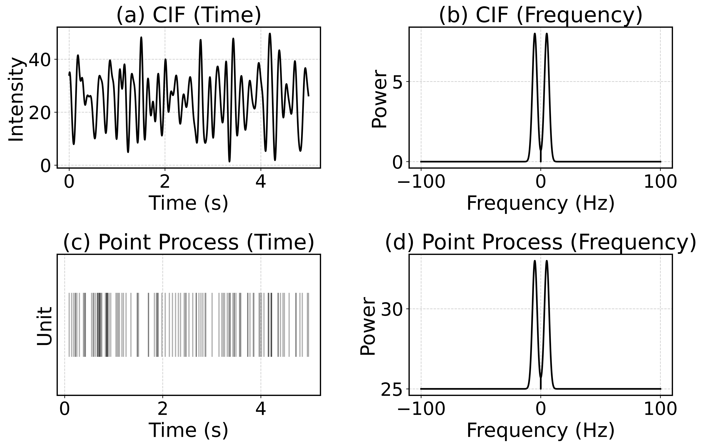
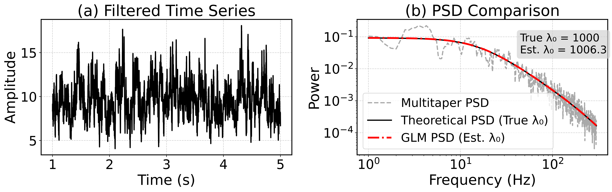

=========================
filtered-point-process
=========================

|ProjectStatus| |VersionDev| |BuildStatus| |License| |Publication|

.. |ProjectStatus| image:: http://www.repostatus.org/badges/latest/active.svg
   :target: https://www.repostatus.org/#active
   :alt: project status

.. |VersionDev| image:: https://img.shields.io/badge/version-in%20development-lightgrey
   :alt: version in development

.. |BuildStatus| image:: https://github.com/fooof-tools/fooof/actions/workflows/build.yml/badge.svg
   :target: https://github.com/fooof-tools/fooof/actions/workflows/build.yml
   :alt: build status

.. |License| image:: https://img.shields.io/badge/License-BSD%203--Clause-blue.svg
   :target: https://opensource.org/licenses/BSD-3-Clause
   :alt: license

.. |Publication| image:: https://img.shields.io/badge/paper-bioRxiv-green.svg
   :target: https://doi.org/10.1101/2024.10.01.616132
   :alt: publication

Beta package associated with the paper 
"Filtered Point Processes Tractably Capture Rhythmic And Broadband Power Spectral Structure 
in Field-based Neural Recordings" (2025)

Patrick F. Bloniasz, Shohei Oyama, Emily P Stephen

Package Setup
=============

1) Install Required Packages
----------------------------
While the package is in development, we recommend downloading in the following way:

Install Mamba through Conda
^^^^^^^^^^^^^^^^^^^^^^^^^^^^

Mamba is a drop-in replacement for conda, but is faster and better at resolving dependency conflicts.

.. code-block:: bash

   conda install mamba -n base -c conda-forge

Create an isolated environment & install filtered-point-process
^^^^^^^^^^^^^^^^^^^^^^^^^^^^^^^^^^^^^^^^^^^^^^^^^^^^^^^^^^^^^^^^

.. code-block:: bash

   git clone https://github.com/Stephen-Lab-BU/filtered-point-process.git
   cd filtered-point-process
   mamba env create -f environment.yml
   mamba activate filtered-point-process
   python -m pip install git+https://github.com/Stephen-Lab-BU/filtered-point-process.git

Quick Start Guide
=================

Point process modeling (e.g., Cox process with spectrally-defined Conditional Intensity Function)
----------------

.. code-block:: python

   import numpy as np
   import matplotlib.pyplot as plt
   from filtered_point_process.model import Model
   
   # ----------------------------------------------------------------------
   # 1) Matplotlib & style settings
   # ----------------------------------------------------------------------
   plt.rcParams.update({
       'axes.linewidth': 1.5,
       'grid.alpha': 0.6,
       'grid.linestyle': '--',
       'font.size': 22,
       'axes.titlesize': 26,
       'axes.labelsize': 24,
       'legend.fontsize': 22,
       'xtick.labelsize': 22,
       'ytick.labelsize': 22,
       'savefig.dpi': 500  # Output resolution
   })
   palette = ['black', 'gray', 'darkgray', 'lightgray']
   time_domain_color = palette[0]
   freq_domain_color = palette[0]
   spike_color = palette[0]
   
   # ----------------------------------------------------------------------
   # 2) Define model & simulation parameters
   # ----------------------------------------------------------------------
   model_name = "gaussian"
   model_params = {
       "peak_height": [8],
       "center_frequency": [5],   # Hz
       "peak_width": [2],        # Hz
       "lambda_0": [25],
   }
   simulation_params = {
       "fs": 200,    # Sampling frequency (Hz)
       "T": 5,       # Total time (s)
       "simulate": True,
       "seed": 1,    # For reproducibility
   }

   # ----------------------------------------------------------------------
   # 3) Create and simulate the model
   # ----------------------------------------------------------------------
   model = Model(model_name, model_params, simulation_params)
   spikes = model.spikes
   
   # ----------------------------------------------------------------------
   # 4) Access CIF outputs
   # ----------------------------------------------------------------------
   time_axis = model.cif.cif_time_axis
   intensity = model.cif.cif_realization.squeeze()
   freqs_cif = model.cif.frequencies
   psd_cif = model.cif.PSD

   # ----------------------------------------------------------------------
   # 5) Compute point-process spectrum 
   # ----------------------------------------------------------------------
   pp_psd = model.pp.frequency_domain.get_PSD()
   
   # ----------------------------------------------------------------------
   # 6) Figure
   # ----------------------------------------------------------------------
   fig, axes = plt.subplots(2, 2, figsize=(12, 8))
   
   # Top-Left: CIF in time domain
   axes[0, 0].plot(time_axis, intensity, color=time_domain_color, lw=2)
   axes[0, 0].set_title("(a) CIF (Time)")
   axes[0, 0].set_xlabel("Time (s)")
   axes[0, 0].set_ylabel("Intensity")
   axes[0, 0].grid(True)
   
   # Top-Right: CIF in frequency domain
   axes[0, 1].plot(freqs_cif, psd_cif, color=freq_domain_color, lw=2)
   axes[0, 1].set_title("(b) CIF (Frequency)")
   axes[0, 1].set_xlabel("Frequency (Hz)")
   axes[0, 1].set_ylabel("Power")
   axes[0, 1].grid(True)
   
   # Bottom-Left: Spike train (event plot)
   axes[1, 0].eventplot(spikes, colors=spike_color, alpha=0.3)
   axes[1, 0].set_title("(c) Point Process (Time)")
   axes[1, 0].set_xlabel("Time (s)")
   axes[1, 0].set_yticks([])
   axes[1, 0].set_ylabel("Unit")
   axes[1, 0].grid(True)
   
   # Bottom-Right: Spike train spectrum 
   axes[1, 1].plot(freqs_cif, pp_psd, color=spike_color, lw=2)
   axes[1, 1].set_title("(d) Point Process (Frequency)")
   axes[1, 1].set_xlabel("Frequency (Hz)")
   axes[1, 1].set_ylabel("Power")
   axes[1, 1].grid(True)
   
   plt.tight_layout()
   plt.show()

Forward modeling of Field Potentials (e.g., LFP/ECoG) and (beta) Parameter Estimation (e.g., AMPA firing rate)
----------------

.. code-block:: python

   import numpy as np
   import matplotlib.pyplot as plt
   import statsmodels.api as sm
   
   # Filtered Point Process imports
   from filtered_point_process.model import Model
   from filtered_point_process.point_processes.filtered_point_process import FilteredPointProcess
   from spectral_connectivity import Multitaper, Connectivity
   
   # ----------------------------------------------------------------------
   # 1) Matplotlib & style settings
   # ----------------------------------------------------------------------
   plt.rcParams.update({
       'axes.linewidth': 1.5,
       'grid.alpha': 0.6,
       'grid.linestyle': '--',
       'font.size': 22,
       'axes.titlesize': 26,
       'axes.labelsize': 24,
       'legend.fontsize': 20,
       'xtick.labelsize': 22,
       'ytick.labelsize': 22,
       'savefig.dpi': 500  # Output resolution
   })
   
   # Color palette
   palette = ['black', 'gray', 'darkgray', 'lightgray']
   time_series_color = palette[0]    # Black for time series
   theoretical_color = palette[0]    # Gray for theoretical PSD
   multitaper_color = palette[2]     # Dark gray for multitaper PSD
   estimated_color = 'red'           # Red for GLM PSD (estimated)
   
   # ----------------------------------------------------------------------
   # 2) Step 1 & 2: Setup Simulation Parameters
   # ----------------------------------------------------------------------
   fs = 10_000          # Sampling frequency (Hz)
   T = 5                # Duration of simulation (s)
   lambda_0 = 1_000       # Poisson rate (Hz)
   seed = 44            # Random seed
   
   model_params = {"lambda_0": lambda_0}
   simulation_params = {"fs": fs, "T": T, "simulate": True, "seed": seed}
   
   # Create a Homogeneous Poisson model and apply a GABA filter
   model = Model("homogeneous_poisson", model_params, simulation_params)
   filters = {"GABA": "GABA"}
   fpp = FilteredPointProcess(filters=filters, model=model)
   fpp.apply_filter_sequences([["GABA"]])
   
   # ----------------------------------------------------------------------
   # 3) Retrieve Time Series & Kernel Spectrum
   # ----------------------------------------------------------------------
   burn_in = fs
   filtered_time_series = fpp.final_time_series[burn_in:]
   time_axis = np.linspace(0, T, len(fpp.final_time_series))[burn_in:]
   
   gaba_filter = fpp.filter_instances["GABA"]
   full_kernel_spectrum = gaba_filter.kernel_spectrum
   theoretical_frequencies = model.frequencies
   theoretical_psd = full_kernel_spectrum * lambda_0
   
   # ----------------------------------------------------------------------
   # 4) Multitaper PSD Estimation
   # ----------------------------------------------------------------------
   n_tapers = 7
   multitaper = Multitaper(
       filtered_time_series,
       sampling_frequency=fs,
       n_tapers=n_tapers,
       start_time=time_axis[0],
   )
   connectivity = Connectivity.from_multitaper(multitaper)
   
   multitaper_psd = connectivity.power().squeeze()
   multitaper_frequencies = connectivity.frequencies
   
   # ----------------------------------------------------------------------
   # 5) Restrict to Positive Frequency Range & Interpolate Theoretical PSD
   # ----------------------------------------------------------------------
   freq_min, freq_max = 1, 300
   valid_theory_idx = np.where(
       (theoretical_frequencies >= freq_min) & (theoretical_frequencies <= freq_max)
   )
   freqs_pos = theoretical_frequencies[valid_theory_idx]
   S_psp_pos = full_kernel_spectrum[valid_theory_idx]
   
   valid_mtap_idx = np.where(
       (multitaper_frequencies >= freq_min) & (multitaper_frequencies <= freq_max)
   )
   multitaper_frequencies_filtered = multitaper_frequencies[valid_mtap_idx]
   multitaper_psd_filtered = multitaper_psd[valid_mtap_idx]
   
   # Interpolate theoretical PSD to match multitaper freq axis
   S_psp_interpolated = np.interp(
       multitaper_frequencies_filtered, freqs_pos, S_psp_pos
   )
   
   # ----------------------------------------------------------------------
   # 6) Fit Gamma GLM (Identity Link)
   # ----------------------------------------------------------------------
   X = S_psp_interpolated.reshape(-1, 1)  # Theoretical PSD as predictor
   y = multitaper_psd_filtered            # Multitaper PSD as response
   
   glm_model = sm.GLM(y, X, family=sm.families.Gamma(link=sm.families.links.identity()))
   glm_results = glm_model.fit()
   
   lambda_0_estimated = glm_results.params[0]
   phi = glm_results.scale
   k = 1 / phi
   
   # ----------------------------------------------------------------------
   # 7) Print Results
   # ----------------------------------------------------------------------
   print(f"Theoretical Rate (lambda_0): {lambda_0}")
   print(f"Estimated Rate (lambda_0):   {lambda_0_estimated:.3f}")
   print(f"Gamma Dispersion (phi):      {phi:.3f}")
   print(f"Gamma Shape (k):             {k:.3f}")
   print(f"Gamma Scale:                 {phi * lambda_0_estimated / k:.3f}")
   
   # Predicted Spectrum from GLM
   glm_predicted_psd = S_psp_interpolated * lambda_0_estimated
   
   # ----------------------------------------------------------------------
   # 8) Figure
   # ----------------------------------------------------------------------
   fig, axes = plt.subplots(1, 2, figsize=(15, 5))
   
   # (a) Filtered Time Series (Burn-in Removed)
   axes[0].plot(time_axis, filtered_time_series, color=time_series_color, lw=2)
   axes[0].set_title("(a) Filtered Time Series")
   axes[0].set_xlabel("Time (s)")
   axes[0].set_ylabel("Amplitude")
   axes[0].grid(True)
   
   # (b) PSD Comparison
   axes[1].loglog(
       multitaper_frequencies_filtered,
       multitaper_psd_filtered,
       label="Multitaper PSD",
       linewidth=2,
       linestyle="--",
       color=multitaper_color
   )
   axes[1].loglog(
       freqs_pos,
       S_psp_pos * lambda_0,
       label="Theoretical PSD (True λ₀)",
       linewidth=2,
       color=theoretical_color
   )
   axes[1].loglog(
       multitaper_frequencies_filtered,
       glm_predicted_psd,
       label="GLM PSD (Est. λ₀)",
       linestyle="-.",
       linewidth=3,
       color=estimated_color
   )
   axes[1].set_title("(b) PSD Comparison")
   axes[1].set_xlabel("Frequency (Hz)")
   axes[1].set_ylabel("Power")
   axes[1].grid(True)
   
   # Show True vs. Estimated λ₀ on the plot
   axes[1].text(
       0.65, 0.75,
       f"True λ₀ = {lambda_0}\nEst. λ₀ = {lambda_0_estimated:.1f}",
       transform=axes[1].transAxes,
       fontsize=18,
       bbox=dict(boxstyle="round,pad=0.3", fc="lightgray", ec="none", alpha=0.7)
   )
   
   axes[1].legend(loc="best")
   plt.tight_layout()
   plt.show()

